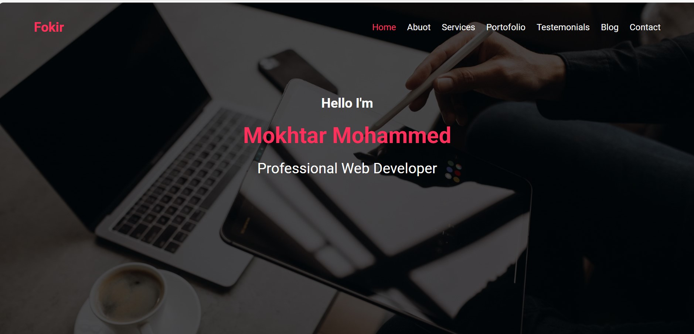

# Fokir Website

A simple personal portfolio website built using **HTML** and **CSS (Flexbox)** only.  
This project is part of my ongoing Full Stack training at Root Academy, and it focuses on modern layout techniques.

## 🎯 What I learned:

- Replacing old methods like `float` with **Flexbox**.
- Aligning and distributing elements using `justify-content` and `align-items`.
- Structuring responsive-ready sections with flexible layouts.
- Creating a cleaner and more maintainable CSS structure.

## 💡 Tools used:

- HTML5
- CSS3 (Flexbox)

## 📸 Preview:

